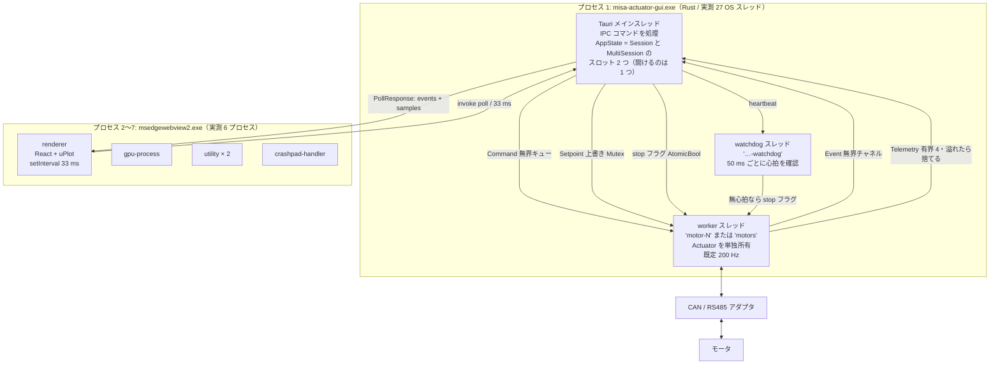
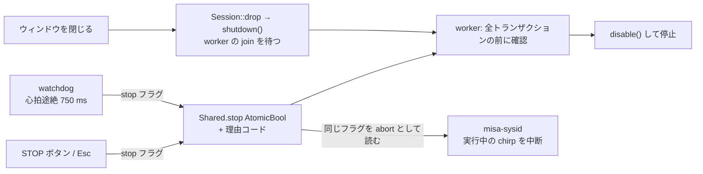
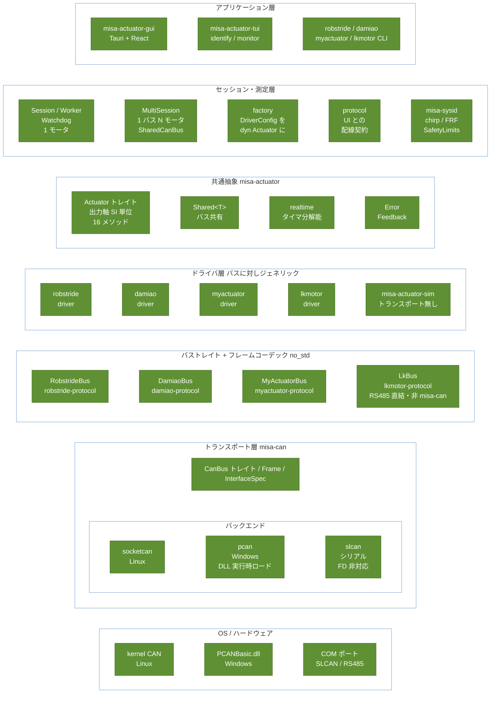
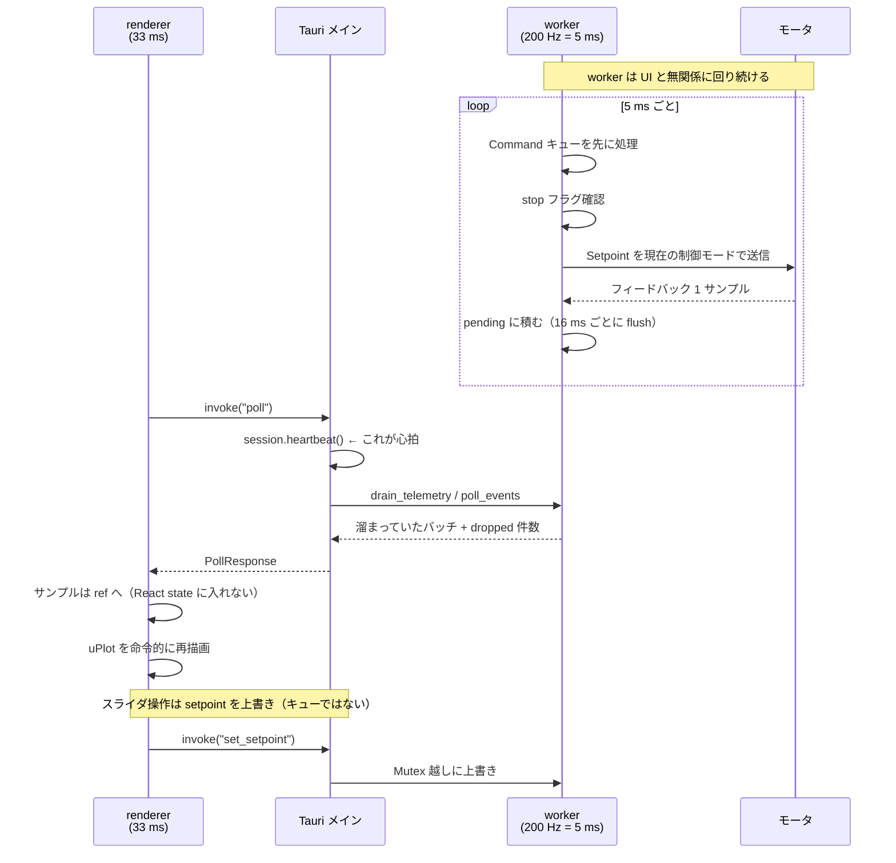

# アーキテクチャ

2026-08-02 時点。**現在の実装がどう組み立てられているか**を 2 つの視点で書く。

- **§1 プロセスとスレッド** — 実行時に何がいくつ動き、どう通信し、どこで止まるか
- **§2 レイヤ構成** — ソースの上下関係と、各境界が存在する理由

この文書は**構造**の説明に徹する。関連文書との住み分け:

| 文書 | 書いてあること |
|---|---|
| [`../README.md`](../README.md) | crate 一覧、対応モータ、コマンド例 |
| [`handover.md`](handover.md) | **なぜそうなったか**、実測値、踏んだ罠。判断の経緯はすべてこちら |
| [`windows.md`](windows.md) | Windows セットアップ、GUI のビルドと配布 |

図中の数値は実装の定数を引いている。出典はすべて `file:line` で示した。

> **この `.md` がマスタ。** ブラウザ用の [`architecture.html`](architecture.html) は
> `node scripts/md2html.js doc/architecture.md` の出力なので、直接編集しないこと
> （次回の生成で消える）。図は `doc/assets/mermaid.min.js` を同梱しており、
> オフラインでも描画される。

---

## 1. プロセスとスレッド

### 1.1 全体像

**プロセス構成は実測値**（2026-08-02、インストール版 0.1.0 を起動して `Win32_Process`
の親子を辿った）。Rust 側は 1 プロセスで、WebView2 が 6 プロセスにぶら下がる:

| プロセス | スレッド | WS | 役割 |
|---|---:|---:|---|
| `misa-actuator-gui.exe` | 27 | 28 MB | Rust 本体。ここに worker と watchdog が居る |
| `msedgewebview2.exe`（ブラウザ） | 54 | 125 MB | WebView2 の親 |
| └ `renderer` | 15 | 75 MB | **React と uPlot はここ**。ここが固まると watchdog の出番 |
| └ `gpu-process` | 32 | 105 MB | 描画 |
| └ `utility` × 2 | 24 / 10 | 36 / 21 MB | ネットワーク・ストレージ等 |
| └ `crashpad-handler` | 11 | 11 MB | クラッシュ収集 |

27 スレッドのうち**この設計が明示的に張るのは 2 本だけ**（worker と watchdog）。
残りは Tauri / tao / WebView2 ホスト側のもので、こちらが管理しているわけではない。

**モータが 4 台でも 2 本のまま。** Multi タブは `MultiSession` を開くが、張るのは
`motors` と `motors-watchdog` の 2 本で、**N 台を 1 本のワーカーで順に回す**（§1.2）。
スロットは 2 つあるが同時に開けるのは 1 つなので、この数え方は台数が増えても変わらない。

### 1.2 スレッドは 1 セッションあたり 2 本

`Session::connect` が両方を spawn する（[session.rs:75-88](../crates/misa-actuator-core/src/session.rs#L75-L88)）。

| スレッド | 生成 | 周期 | 責務 |
|---|---|---|---|
| `motor-N` (worker) | [session.rs:75](../crates/misa-actuator-core/src/session.rs#L75) | 既定 200 Hz（1〜2000 Hz） | **バスに触る唯一の場所**。`Box<dyn Actuator + Send>` を単独所有 |
| `motor-N-watchdog` | [session.rs:85](../crates/misa-actuator-core/src/session.rs#L85) | 50 ms 固定 | 心拍が途絶えたら stop フラグを立てる |

**1 バスに複数モータのときも 2 本のまま。** `MultiSession`（`multi_session.rs`）は
`motors` / `motors-watchdog` の 2 本で **N モータを順に回す**。モータ毎スレッドには
**しない** — ベンダーのバストレイトは send と recv が別呼び出しで、共有バスでは
同時に 1 交換しか許されないため、**1 台ずつ回すことが安全の根拠**になっている。
バスは `SharedCanBus`（`Arc<Mutex<Box<dyn CanBus>>>` 自身が `CanBus`）で共有するので、
4 ベンダーのアダプタは無改造で乗る。

**1 巡には予算がある。** `Worker::pass()` に与えられるのは**ティック 1 周期分だけ**で、
切れたら残りを飛ばし、**次パスで先頭に回す**。予算が無いと**遅い 1 台が全員のレートを
決める**ためで、これは想像ではなく実測（DAMIAO のレジスタ読み欠落、handover §4）。
飛ばした回数は `starved` としてスナップショットに出る — **0 でなければ、レートを
決めているのは設定したティックではなくワイヤ**。

**各交換の前にワイヤを掃く**（`SharedCanBus::drain_stale()`、タイムアウト 0 で最大
64 フレーム）。フィードバックフレームに**シーケンス番号が無い**ので、掃かないと
前のターンの残骸を今のターンの答えとして読む。捨てた数は返して報告する —
**見えない破棄は否定できない破棄**。

**なぜ watchdog を worker のループ内チェックにしないか。** これは整理の問題ではなく、
ループ内では**成立しない**。`misa-sysid` の測定ジョブは worker のループを数十秒
占有するので、ループ内チェックは**一番危険な時間帯にちょうど動かない**
（[worker.rs:163-170](../crates/misa-actuator-core/src/worker.rs#L163-L170)）。別スレッドなら
worker が何をしていようが検査が続く。

**なぜ worker がバスを単独所有するか**（[worker.rs:1-9](../crates/misa-actuator-core/src/worker.rs#L1-L9)）:

- UI が 1 ms のバストランザクションでブロックしない
- 制御レートがフレームレートから独立する
- **UI が死ぬとコマンドチャネルが閉じ、worker がそれを検知して disable して終わる**
  （[worker.rs:274](../crates/misa-actuator-core/src/worker.rs#L274)）。監視役が要らない

### 1.3 チャネルは 4 種類あり、種類が違うことに意味がある

`Session` ↔ worker の通信は**性質ごとに別の仕組み**を使う。ここが設計の中心。

| 経路 | 実装 | 溢れたら | なぜ |
|---|---|---|---|
| **Setpoint** | `Mutex<Setpoint>` を**上書き** | 上書きなので溢れない | 位置スライダを動かすたびに指令が積み上がってはいけない |
| **Command** | `mpsc::channel` 無界**キュー** | 溜まる | Enable / Disable / SetZero は**取りこぼしてはいけない** |
| **Telemetry** | `sync_channel(4)` 有界 | **捨てて件数を報告** | UI が遅れたらサンプルは捨てて良い。ただし黙って捨てない |
| **Event** | `mpsc::channel` 無界 | 溜まる | 状態変化・ログ・エラーは捨てない |
| **stop** | `AtomicBool` + 理由 `AtomicU8` | — | **キューに並ぶ停止は停止ではない**（後述） |

定数: 深さ 4 は「もたつく再描画 1 回分は吸収するが、プロットが目に見えて遅れない」
ところ（[session.rs:16-19](../crates/misa-actuator-core/src/session.rs#L16-L19)）。溢れた分は
`TelemetryBatch.dropped` として報告され、UI は**滑らかな線を引かずに欠落を出せる**
（[worker.rs:943-953](../crates/misa-actuator-core/src/worker.rs#L943-L953)）。これは handover §8
「測定でないものを測定のように見せない」の具体例。

### 1.4 停止経路は 3 系統ある

1. **STOP** — `Command` では**なく**フラグ（[session.rs:141-149](../crates/misa-actuator-core/src/session.rs#L141-L149)）。
   キューの後ろに並ぶ停止は停止ではない。同じフラグを `misa-sysid` が abort として
   読むので、走っている chirp も切れる
2. **watchdog** — 既定 750 ms（[protocol.rs:576](../crates/misa-actuator-core/src/protocol.rs#L576)）。
   **streaming 中かジョブ実行中だけ**有効。止まっていないセッションを叱っても雑音
3. **Drop** — `shutdown()` は「フラグ→Shutdown コマンド→worker を join」の順。
   watchdog は**worker より後に**落とす。ジョブから抜けかけの worker が
   途中で保護を失わないため（[session.rs:205-224](../crates/misa-actuator-core/src/session.rs#L205-L224)）

**`MultiSession` も同じ 3 系統**で、加えて 1 つ規則がある: **`disable_all()` は
失敗しても次のモータに進む**。途中で `?` を返すと、応答しない 1 台のせいで
**残りが通電したまま**になる。停止は「全部に届く」ことが要件なので、
最初のエラーで抜けてはいけない。

**ただし**: これらは**ソフトウェアの停止経路**であって、モータが無励磁でラッチ
されることを意味しない。handover §2 を読むこと。

### 1.5 ポーリングであって push ではない

フロントは 33 ms 間隔の `setInterval` で `poll` を 1 回投げ、前回以降の全イベントと
全サンプルを受け取る（[useSession.ts:34](../ui/src/useSession.ts#L34)、
[lib.rs:8-25](../crates/misa-actuator-gui/src/lib.rs#L8-L25)）。push チャネルが無いのは:

- **背圧がただで手に入る。** 遅れたフロントは poll 回数が減るだけ。有界チャネルが
  余りを捨て、件数を報告する
- **poll がそのまま心拍になる。** コマンドを呼べている renderer は定義上生きている。
  固まった renderer は poll を止め、watchdog がモータを落とす —
  **STOP ボタンでは絶対にカバーできないケース**（押す人が居ない）
  （[lib.rs:293-294](../crates/misa-actuator-gui/src/lib.rs#L293-L294)）

代償も明示されている: **ウィンドウを最小化すると心拍が止まり、streaming 中なら
モータが落ちる。** 意図した挙動（`watchdogMs` で調整可）。

`rAF` ではなく `setInterval` なのも同じ理由 — rAF は隠れたウィンドウで**完全に停止**し、
固まった renderer と見分けが付かなくなる（[useSession.ts:11-14](../ui/src/useSession.ts#L11-L14)）。

フロント側の鉄則がもう 1 つ: **テレメトリを React state に入れない。** 1 kHz で
setState したらツリーが毎秒数千回再描画されて落ちる。サンプルは ref に入れ、
プロットが命令的に読む。React が見るのは最新 1 点と低頻度イベントだけ。

### 1.6 GUI 以外は単一スレッド

**`Session` を使うのは GUI だけ。** TUI と 4 つの CLI は `Box<dyn Actuator>` を直接
持ち、ブロッキングで回す（[app.rs:26](../crates/misa-actuator-tui/src/app.rs#L26)）。
ワーカースレッドも watchdog も無い。

これは手抜きではなく用途の違い: CLI は 1 コマンド 1 トランザクションで終わり、
UI フレームを落とす相手が居ない。逆に言うと **CLI には watchdog も Drop 保護も無い**
（handover §2「CLI は Session の安全網の外にいる」）。

複数モータを 1 本の線で駆動する共有機構は **2 段ある**。混同しやすいので分けて書く。

- **`Shared<T>`**（[shared.rs](../crates/misa-actuator/src/shared.rs)、`misa-actuator`）は
  **各社のバストレイト**を共有する。`Arc<Mutex<T>>` を各社が自分のトレイトに実装する
  （孤児則を避けるためこの向き）。**CAN 系は要求と応答が別呼び出しなので、
  1 つの原子的トランザクションにはならない**。例外は LK Motor で、`LkBus::transact`
  が 1 呼び出しなので `Shared<B>` の実装がそのまま原子的になる
- **`SharedCanBus`**（[multi.rs](../crates/misa-actuator-core/src/multi.rs)、
  `misa-actuator-core`）は**その 1 段下、`misa_can::CanBus` を共有する**。
  `CanBus` 自身を実装しているので、**4 社のアダプタを無改造で乗せられる**のが
  こちら。`MultiSession` が使うのはこれ

どちらでも **バス 1 本につき制御ループ 1 本**が想定パターンで、それが上記の
非原子性への答えになっている。モータ毎スレッドは動くが推奨しない。

---

## 2. レイヤ構成

### 2.1 スタック

上の層が下の層に依存する。**枠の入れ子が包含関係**で、層の中に矢印は引いていない
（依存の向きは上から下で一定なので、矢印を足しても情報が増えない）。

### 2.2 抽象は 2 層ある

これが構造の要。**なぜ `protocol` / `driver` / `cli` がベンダーごとに 3 つ組で
存在するのか**の答えでもある。

| 層 | 何を隠すか | 誰が見るか |
|---|---|---|
| **`Actuator`**（[traits.rs:26](../crates/misa-actuator/src/traits.rs#L26)） | ベンダーの違い | GUI・TUI・sysid。**これしか見ない** |
| **ベンダー別バストレイト** | トランスポートの違い | そのベンダーのドライバだけ |

`Actuator` は出力軸 SI 単位（rad / rad/s / N·m）に統一されていて dyn-compatible。
だから `Box<dyn Actuator>` で実行時にベンダーを切り替えられる。
**拡張は既定実装つきメソッドで足す** — そうしないと 4 ドライバ全部を同時に触ることになる。

ドライバがバストレイトに対してジェネリックなので、同じプロトコル実装が
CAN でも RS485 でも動く。CAN 系 3 社は `misa-can` を共有するので、
**新しいアダプタは 1 回実装すれば 3 社に効く**。

### 2.3 依存の向きで気をつけている点

- **`factory` は `misa-actuator-core` に居る**（TUI ではなく）。GUI が TUI crate に
  依存する形を避けるため。`misa_actuator_tui::factory` は再エクスポートで互換を
  保っているだけ（[lib.rs:7-11](../crates/misa-actuator-tui/src/lib.rs#L7-L11)）
- **`misa-actuator-core` は UI に一切依存しない**。GUI・TUI・将来のヘッドレス
  サーバが同じ `Session` に乗る。テストは `misa-actuator-sim` 相手に実機なしで走る
- **`misa-actuator-gui` は意図的に薄い**。挙動を決めるもの（制御ループ、
  setpoint/command 分離、watchdog、停止経路）は全部 core 側にある。
  **webview 無しでテストできる場所に置く**ため（[lib.rs:1-6](../crates/misa-actuator-gui/src/lib.rs#L1-L6)）
- **`*-protocol` は `no_std`**。フレームのエンコード/デコードだけで I/O を持たない
- 図では省いたが、`misa-actuator-core` は `misa-can` にも直接依存している。ただし
  用途は 1 か所、既定インターフェース文字列の取得だけ
  （[factory.rs:118](../crates/misa-actuator-core/src/factory.rs#L118)）。**バスを開くのは
  ドライバ**で、層を飛び越えているわけではない
- **`misa-actuator-gui` は `default-members` の外**。素の `cargo build` / `cargo test`
  が Node 無しで通る

### 2.4 PCAN だけ実行時ロードである理由

`PCANBasic.dll` は `LoadLibrary` で実行時に解決する
（[pcan.rs:3-8](../crates/misa-can/src/backend/pcan.rs#L3-L8)）。リンク時依存にすると
**PEAK ドライバの無いマシンでアプリが起動すらできなくなる**。遅延ロードなので
アダプタが無くても GUI は立ち上がり、接続を押した時に初めて明示的なエラーが出る
（接続失敗バナーが対処しているのがまさにこの経路）。

---

## 3. 制御が一周する流れ

streaming 中の 1 サイクル。左が 33 ms 周期、右が 5 ms 周期であることに注意。

---

## 4. 周期と容量の一覧

実装の定数。チューニングする時はここを見る。

| 値 | 既定 | 出典 |
|---|---|---|
| worker のティック | **200 Hz**（1〜2000 Hz） | [protocol.rs:562-564](../crates/misa-actuator-core/src/protocol.rs#L562-L564) |
| テレメトリ flush 間隔 | 16 ms | [protocol.rs:570](../crates/misa-actuator-core/src/protocol.rs#L570) |
| テレメトリチャネル深さ | 4 バッチ | [session.rs:19](../crates/misa-actuator-core/src/session.rs#L19) |
| ステータス読み | 500 ms | [protocol.rs:567](../crates/misa-actuator-core/src/protocol.rs#L567) |
| 非 streaming 時のポーリング | 50 ms | [worker.rs:28](../crates/misa-actuator-core/src/worker.rs#L28) |
| watchdog タイムアウト | **750 ms**（0 で無効） | [protocol.rs:576](../crates/misa-actuator-core/src/protocol.rs#L576) |
| watchdog の確認間隔 | 50 ms | [worker.rs:161](../crates/misa-actuator-core/src/worker.rs#L161) |
| 連続故障の打ち切り | 20 回 | [worker.rs:24](../crates/misa-actuator-core/src/worker.rs#L24) |
| UI の poll 間隔 | 33 ms | [useSession.ts:34](../ui/src/useSession.ts#L34) |
| プロット保持サンプル数 | 6000（200 Hz で約 30 秒） | [useSession.ts:37](../ui/src/useSession.ts#L37) |

`MultiSession` は別の定数を持つ。**ティックと watchdog は単体と同じ**（200 Hz /
750 ms）が、それ以外は「4 台を表で見る」用途に合わせて違う。

| 値 | 既定 | 出典 |
|---|---|---|
| スナップショット深さ | **2**（単体は 4） | [multi_session.rs:51](../crates/misa-actuator-core/src/multi_session.rs#L51) |
| 非 streaming 時のポーリング | 50 ms | [multi_session.rs:54](../crates/misa-actuator-core/src/multi_session.rs#L54) |
| 連続故障の打ち切り | **20 回、モータ毎** | [multi_session.rs:60](../crates/misa-actuator-core/src/multi_session.rs#L60) |
| watchdog の確認間隔 | 50 ms | [multi_session.rs:185](../crates/misa-actuator-core/src/multi_session.rs#L185) |
| バスのタイムアウト | 100 ms（**チャネル単位**） | [multi.rs:207-209](../crates/misa-actuator-core/src/multi.rs#L207-L209) |
| 1 パスの予算 | ティック 1 周期 | [multi_session.rs:638](../crates/misa-actuator-core/src/multi_session.rs#L638) |
| 残骸の掃き出し上限 | 64 フレーム/交換 | [multi.rs:87](../crates/misa-actuator-core/src/multi.rs#L87) |
| Multi タブの poll 間隔 | **100 ms**（単体は 33 ms） | [MultiTab.tsx:31](../ui/src/components/MultiTab.tsx#L31) |

**深さ 2 と poll 100 ms は同じ判断から来ている。** プロットが無いので、欲しいのは
常に最新の 1 枚で、古い読み値には価値が無い。逆に `achieved_rate_hz` と `starved`
は出す — 台数で割られたレートを黙って報告しないと、数字の意味が変わったことに
気付けない。

**Windows ではタイマ分解能を明示的に上げている。** 既定の sleep は ~15.6 ms に
丸められ、それだけで制御ループが 64 Hz に張り付く。worker は起動時に
`TimerResolutionGuard` を取る（[worker.rs:260-262](../crates/misa-actuator-core/src/worker.rs#L260-L262)）。

---

## 5. この構成の制約

正直に書いておく。設計上そうなっているだけで、直せないものではない。

- **セッションのスロットは 2 つで、同時に開けるのは 1 つ。** `AppState` は
  `Mutex<Option<Session>>`（既存 5 タブ、1 モータ）と `Mutex<Option<MultiSession>>`
  （Multi タブ、N モータ）を別々に持つ（[lib.rs](../crates/misa-actuator-gui/src/lib.rs)）。
  **1 CAN チャネルの所有者は 1 つ**なので、片方が開いていればもう片方は
  `PCAN_ERROR_NETINUSE` になる。UI は開いている側を指して断る（`open_elsewhere`）
- **`Session` と `MultiSession` は別実装で、worker / watchdog / 停止経路が二重にある。**
  既存 5 タブの配線契約を守るための意図的な判断だが、**安全に関わる部分が 2 箇所に
  ある**のは重複の中でも最悪の種類。出口は `build_actuator` の「開く」と「束ねる」の
  分離と、worker の 1..N 対応で、単体を N=1 の薄いラッパにすること
- **1 バスに複数モータでも、同時に 1 交換しか流せない。** 逐次に回すのが安全の
  根拠なので、レートは台数で割られる（4 台なら 1 台あたり約 1/4）。
  さらに **1 交換はバスのタイムアウト全部を使い得る**（タイムアウトは共有
  トランスポートの持ち物で、モータ毎には設定できない）。`Worker::pass()` の予算は
  **何台が遅れるかを縛るだけで、1 回の長さは縛らない** — モータ毎タイムアウトは
  トランスポート側の変更が要る
- **測定ジョブは worker のループを占有する。** 数十秒間、通常の制御ティックは
  回らない。`job_active` フラグはそれを外から知るための手段
- **`Shared<T>` の要求と応答は原子的ではない。** 同一バスでモータごとに
  スレッドを立てることは可能だが推奨しない
- **停止は「ソフトウェアが指令を出すのをやめる」までを保証する。**
  無励磁のラッチではない（handover §2）
- **バックエンドは 3 種類。** gs_usb / candleLight は未実装。SLCAN は CAN-FD 非対応
